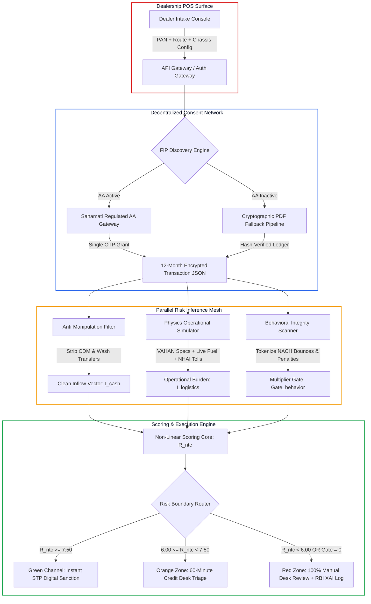

# Systems Architecture RFC: Green-Channel Gateway

**Title:** High-Throughput, Low-Latency Automated Underwriting Architecture  
**Author:** Akshat Barthwal  
**System Class:** Financial Transaction Inference & Real-Time Risk Routing  
**Design Target:** Sub-60s Data Pipeline Latency | Sub-5 Minute End-to-End Counter SLA  

---

## 1. System Topology & Data Flow

---

## 2. Core Mathematical Formulations

### 2.1 Clean Inflow Isolation ($I_{\text{cash}}$)
Let $\mathbb{T} = \{t_1, t_2, \dots, t_N\}$ represent all incoming credits across the 12-month ledger. The verified revenue inflow is:
$$I_{\text{cash}} = \sum_{t \in \mathbb{T}} \text{Amount}(t) \cdot \Phi(t)$$

Where the validity filter $\Phi(t) = 1$ if:
$$\text{Mode}(t) \notin \{\text{CASH}, \text{CDM}\} \quad \land \quad \text{Hash}(\text{Sender}) \ne \text{Hash}(\text{Borrower}) \quad \land \quad \text{Narrative}(t) \not\sim \text{Regex}_{\text{self}}$$

### 2.2 Operational Simulation (RSEE)
Instead of historical expense tracking, projected monthly operational expense $C_{\text{operating}}$ is derived dynamically:
$$C_{\text{operating}} = \left( \frac{D_{\text{simulated}}}{\text{FE}_{\text{chassis}}} \times P_{\text{fuel}} \right) + T_{\text{NHAI}}(\text{Route}) + M_{\text{crew}}$$

* $D_{\text{simulated}}$: Dynamic monthly distance tied to chassis payload category ($1,800\text{ to }4,200\text{ km/month}$).
* $\text{FE}_{\text{chassis}}$: Certified chassis fuel economy ($9.5\text{ to }25.0\text{ km/unit}$).
* $P_{\text{fuel}}$: Real-time spot fuel/CNG price.
* $T_{\text{NHAI}}(\text{Route})$: Cumulative electronic toll charge mapped to the declared corridor.
* $M_{\text{crew}}$: Baseline driver and ad-hoc maintenance allowances.

### 2.3 Non-Linear Behavioral Multiplier Gate
To eliminate compensatory scoring bias, behavioral infractions operate as a zero-multiplier tripwire:
$$\text{Gate}_{\text{behavior}} = \begin{cases} 
1.0 & \text{if } N_{\text{NACH}} \le 1 \land N_{\text{Bounce}} = 0 \land \text{Penalties} < 0.15 \times \text{EMI} \\
0.0 & \text{if } N_{\text{NACH}} \ge 2 \lor N_{\text{Bounce}} \ge 1 \lor \text{Penalties} \ge 0.15 \times \text{EMI}
\end{cases}$$

### 2.4 Composite Underwriting Rating
$$R_{\text{ntc}} = \left[ 0.35 \cdot S_{\text{cash}} + 0.20 \cdot S_{\text{logistics}} + 0.20 \cdot S_{\text{liability}} + 0.10 \cdot S_{\text{personal}} + 0.15 \cdot 9.0 \right] \times \text{Gate}_{\text{behavior}}$$

---

## 3. Latency Budget & SLA Enforcement

| Pipeline Stage | Target Latency ($p50$) | Max Ceiling ($p95$) | Concurrency & Optimization |
| :--- | :--- | :--- | :--- |
| **1. Consent Handshake** | $18.0\text{ s}$ | $35.0\text{ s}$ | Direct mobile OTP via Sahamati AA gateway. |
| **2. Cryptographic Parsing** | $1.2\text{ s}$ | $2.5\text{ s}$ | In-memory stream parser with vectorized token extraction. |
| **3. External APIs (Toll/Fuel)** | $0.4\text{ s}$ | $1.0\text{ s}$ | Redis-cached NHAI toll matrices and weekly fuel tables. |
| **4. Physics Simulation Core** | $0.1\text{ s}$ | $0.2\text{ s}$ | Deterministic NumPy operational envelope simulation. |
| **5. Decision & Sanction PDF** | $1.5\text{ s}$ | $3.0\text{ s}$ | Pre-rendered SVG/HTML template conversion. |
| **Total Engine Latency** | **$21.2\text{ s}$** | **$41.7\text{ s}$** | **Guarantees <5 minute showroom counter SLA.** |
